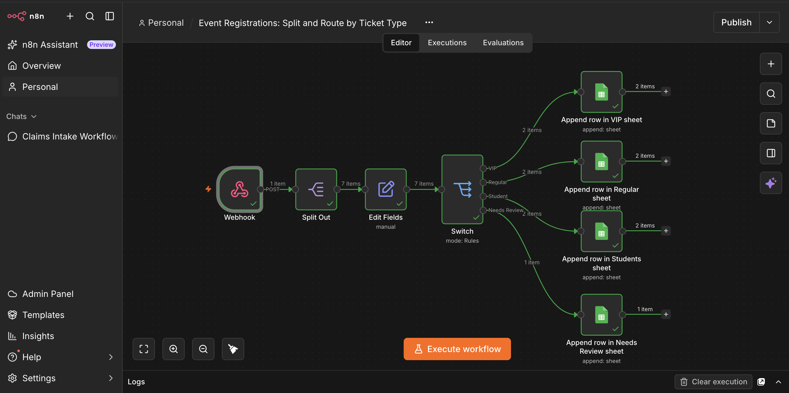

# Event Registration Router (n8n)

An n8n workflow that takes a bundled batch of event registrations, splits them into one record per person, cleans up the field names, and sends each person to a separate Google Sheets tab based on their ticket type. Anything with a ticket type the workflow doesn't recognise goes to its own review tab, so nobody gets lost.



## The problem

The client runs training events and collects registrations through a form on their website. Their system sends everything for one event as a single JSON payload, and three things were causing them real trouble.

All the registrations arrived bundled together in one array, when they needed to be handled one person at a time. The field names were short codes like `fn`, `em` and `tkt`, which their assistant couldn't make sense of. And VIP, regular and student tickets are handled by different people, so each type needed to end up in a different place.

There were two more problems sitting underneath those. The ticket type field is free text, so people sometimes type in things nobody planned for. In the sample I was given, one registration came through as `complimentary`. The last automation built for this client quietly dropped records like that, and they only found out when a customer complained. On top of that, their accountant had tried to total the amounts in a previous export and got nothing back, which pointed to the amounts being stored as text instead of numbers.

## Questions I asked before building

Before touching n8n, I wrote down three questions for the client. I wanted to understand the parts of the brief that would change how I built things, not just confirm what was already written down.

**1. How should unrecognised ticket types be handled long term?**
Records like the `complimentary` ticket need somewhere safe to land. I asked whether the client wanted an automatic alert (Slack or email) to their assistant whenever something hits that queue, or whether those records should go straight to a particular person.

**2. How should unpaid registrations be treated?**
Two people in the sample (Ife Adeyemi and Tunde Okafor) had `paid: false`. The brief didn't say what to do with them. I asked whether unpaid registrations should still go straight to the ticket handlers, or be held in a "Pending Payment" queue first.

**3. Where should each route send its records?**
The brief says each ticket type goes "to a different place" but doesn't say where. I asked which tools each team uses (Google Sheets, Airtable, a CRM, email) so the routes would end up somewhere people actually look.

## How I addressed those questions

These were sent to the client before the build. Rather than guess at answers I didn't have, I built each part so it works now and is easy to change once the client decides.

For unrecognised tickets, I built a dedicated **Needs Review** output and a matching Google Sheets tab. That covers the client's main requirement, which is that nothing disappears. The alert they might want later is a single extra node on that route.

For unpaid registrations, every record carries a `paid` column as a true/false value, so each team can filter or sort by payment status in their own tab straight away. I didn't build a separate hold queue, because that changes who sees the record first and the client should make that call.

For destinations, I used one Google Sheets file with a tab for each route as a stand-in. It's easy for the client to see and check, and swapping a Sheets node for Airtable, a CRM or an email node doesn't change anything earlier in the workflow.

## What I built and why

The workflow runs in five stages.

**Webhook.** Receives the POST request from the registration system. Using a webhook means the client's system can push data in as soon as an event closes, without anyone exporting or uploading a file.

**Split Out.** Breaks the `registrations` array apart so each person becomes their own item. The sample goes in as 1 item and comes out as 7. Everything after this point works on one person at a time, which is what makes per-person routing possible.

**Edit Fields.** Renames the short codes to readable names (`first_name`, `last_name`, `email`, `ticket_type`, `amount`, `paid`) and adds a `full_name` field that joins first and last name with a space. The old field names are dropped so the output stays clean.

This is also where I fixed the accountant's problem. `amount` is explicitly set to the Number type and `paid` to Boolean. Without that, the values look the same on screen but anything downstream treats them as text, which is exactly why the totals failed before.

**Switch.** Routes each person by `ticket_type` into four outputs: VIP, Regular, Student and Needs Review. The fourth is the Switch node's fallback output, which catches anything that didn't match a rule. This is the most important setting in the workflow. Without a fallback, the Switch node discards unmatched items without any warning, and that's how the client lost registrations last time.

Because the ticket type is free text, each rule cleans the value before comparing it, using `.trim().toLowerCase()`. That way `VIP`, `Vip ` and ` vip` all reach the VIP route instead of landing in Needs Review just because of a capital letter or a stray space. The methods are written with optional chaining (`?.trim()?.toLowerCase()`), so a registration that arrives with no ticket field at all doesn't throw an error and stop the whole batch. It fails to match any rule and drops through to Needs Review like any other unrecognised ticket.

**Google Sheets (four nodes).** Each output appends rows to its own tab in one spreadsheet. Keeping all four tabs in a single file means everything for one event lives in one place.

## Result

Running the sample payload through the workflow gives:

| Route | People |
|---|---|
| VIP | 2 |
| Regular | 2 |
| Student | 2 |
| Needs Review | 1 (the complimentary ticket) |

That's 7 people in and 7 people out, with every field readable and `amount` stored as a number.

## Known limitations and next steps

The ticket type is cleaned inside the Switch rules, not in Edit Fields. Routing works correctly either way, but the Sheet stores the value exactly as the person typed it, so a VIP row could show `VIP ` with a capital and a trailing space. Moving the cleanup into Edit Fields would tidy the stored value too and mean the logic lives in one place instead of three. I'd make that change before handing this over to a client.

The event name, date and venue aren't carried onto each person's record. That's fine while each payload covers a single event, but if the client starts sending several events at once, those fields should be added to Edit Fields so each row shows which event it belongs to.

Once the client answers the questions above, the next additions would be an alert on the Needs Review route, a decision on whether unpaid registrations need their own queue, and swapping the Sheets nodes for whatever tools each team uses.

## How to run it yourself

1. In n8n, go to **Workflows**, choose **Import from File**, and select `workflow/event-registrations-router.json`.
2. Create a Google Sheet with four tabs named `VIP`, `Regular`, `Student` and `Needs Review`. Add these headers to row 1 of each tab: `first_name`, `last_name`, `email`, `ticket_type`, `amount`, `paid`, `full_name`.
3. Open each Google Sheets node, connect your own Google credential, and select your spreadsheet and the matching tab. The exported file has placeholders where my spreadsheet ID and credential were.
4. Open the Webhook node, click **Listen for test event**, and copy the test URL.
5. Send the sample data from your terminal:

```bash
./test/send-test.sh "https://your-n8n-instance/webhook-test/event-registrations"
```

You should see 2, 2, 2 and 1 items on the four Switch outputs, and matching rows in each tab.

## Repository contents

```
event-registration-router/
├── README.md
├── workflow/
│   └── event-registrations-router.json   n8n export, personal IDs removed
├── sample-data/
│   └── sample-payload.json               the test payload from the brief
├── test/
│   └── send-test.sh                      sends the sample to your webhook
└── screenshots/
    └── workflow-canvas.png
```

The names and email addresses in the sample data are test data supplied with the brief.

## Skills this project shows

Receiving data through webhooks, reshaping nested JSON into individual records, mapping fields and setting data types, conditional routing with a fallback so no record is dropped, connecting to Google Sheets, and asking the right questions before building instead of filling the gaps with assumptions.

Built with n8n and Google Sheets by Paidamoyo, Clarity Desk.
